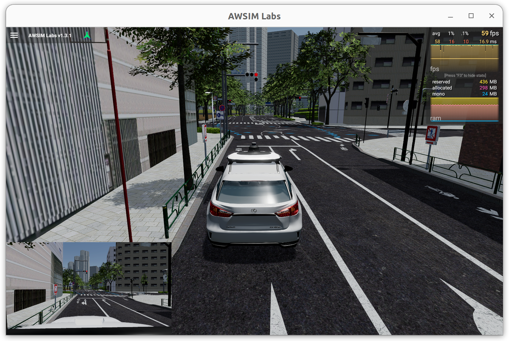
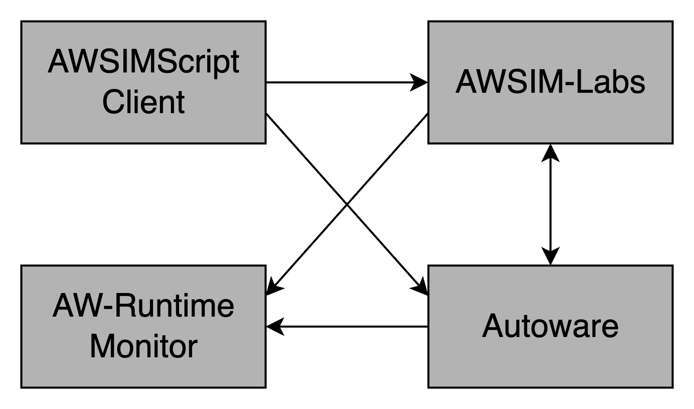

# AWSIM Labs

This is a fork and extended version of [Autoware Foundation's AWSIM-Labs](https://github.com/autowarefoundation/AWSIM-Labs), supporting some advanced behaviors for NPC vehicles and pedestrians. 

## Additional Features

- Various options to control NPC behaviors, such as, lane change, different acceleration and deceleration profiles for different NPCs, and motion delays.
- Two scenario description languages to specify desired scenarios: [AWSIM-Script](https://github.com/duongtd23/AWSIMScriptPy-Client/blob/main/Origin-AWSIM-Script.md) and [AWSIM-ScriptPy](https://github.com/duongtd23/AWSIMScriptPy-Client).
The usage of both languages is explained in the [AWSIM-ScriptPy repo](https://github.com/duongtd23/AWSIMScriptPy-Client), so please check it out for more details.

## Installation

The environment requirements are listed here: https://autowarefoundation.github.io/AWSIM-Labs/main/GettingStarted/SetupUnityProject/#environment-preparation.

Please follow the installation instructions in the original AWSIM-Labs repo: https://autowarefoundation.github.io/AWSIM-Labs/main/GettingStarted/QuickStartDemo/ to make:
- DDS configuration
- CycloneDDS configuration
- Nvidia GPU driver installation (Skip if already installed).

## Launching Binary Release

You can download a binary release from [here](https://github.com/duongtd23/AWSIM-Labs/releases/download/v0.1-alpha/awsim_labs.zip), unzip it, and launch the simulator using:

```bash
./awsim_labs.x86_64
```

It may take some time for the application to start, so please wait until a window like the one below appears:


By default, Gaussian noise is added to the simulated data of LiDAR sensors. Use option -noise false to disable this noise.

```bash
./awsim_labs.x86_64 -noise false
```

## Using AWSIM-Script and AW-Runtime-Monitor
AW-Runtime-Monitor (https://github.com/duongtd23/AW-Runtime-Monitor) is a runtime monitor that:
- Records traffic participants' dynamics and ADS (Autoware) internal state (e.g., planning trajectories, control commands, perceived objects, etc.) during simulation and dumps the information to a trace file once the simulation finishes.
- Can monitor the safety of a control command produced by ADS, and if it is unsafe, activate AEB.

The idea of using AWSIM-Script and AW-Runtime-Monitor together with AWSIM-Labs and Autoware is shown in the figure below. 
We can replace  AWSIM-Script with other scenario description language, e.g., Scenic (interested user can check the [extended Scenic](https://github.com/fomaad/Scenic) to be work with AWSIM-Labs).



To launch these tools together,
in addition to AWSIM-Labs (this repo), clone AWSIMScriptPy-Client and AW-Runtime-Monitor repos.
#### 1. Launch AWSIM-Labs and Autoware.
For AWSIM-Labs, download and run the binary version as explained above.

For Autoware, a detailed installation and launch instruction is available in this repo: https://github.com/dtanony/Autoware0412.
Please follow the instructions until you can launch Autoware and connect it to AWSIM-Labs.


#### 2. Launch AW-Runtime-Monitor
Instructions to install and launch AW-Runtime-Monitor are available in its [repository](https://github.com/duongtd23/AW-Runtime-Monitor).

After launching Autoware and AWSIM-Labs and they are connected, run the following command in another terminal:
```bash
python main.py -o <path-to-folder-to-save-traces> -v false
```

where the options `-v false` disable shielding. By default, it is enabled.
Note that you need to source Autoware's setup file before launching the monitor.
For more details about the tool usage, use `python main.py -h`.

```bash
$ python main.py -h
usage: main.py [-h] [-o OUTPUT] [-f {json,yaml}] [-n NO_SIM] [-v {true,false}]

Runtime Monitor for Autoware and AWSIM simulator. Adjust the component to record data by modifying
file config.yaml

options:
  -h, --help            show this help message and exit
  -o OUTPUT, --output OUTPUT
                        Output trace file name (default: auto-generated with timestamp)
  -f {json,yaml}, --format {json,yaml}
                        either json or yaml (default: json)
  -n NO_SIM, --no_sim NO_SIM
                        Simulation number, use as suffix to the file name (default: 1)
```

#### 4. Run scenario with AWSIM-Script client library:
Instructions to specify and run a scenario with the original AWSIM-Script and AWSIM-ScriptPy (Python interface) are available at: https://github.com/duongtd23/AWSIMScriptPy-Client.

## Unity Project Setup
We recommend using the binary release for most use cases. However, if you want to run the simulator inside the Unity Editor or make some modifications, follow this instruction from AWSIM-Labs document to import this project to the Unity Editor: https://autowarefoundation.github.io/AWSIM-Labs/main/GettingStarted/SetupUnityProject/.
